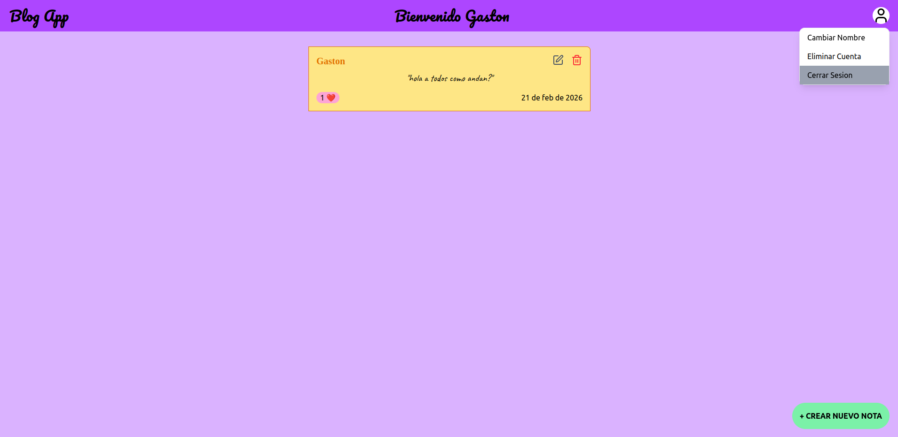

# Blog App - Frontend

Aplicacion web desarrollada con React + TypeScript + Tailwind CSS  que permite a los usuarios registrarse, verificar su email, iniciar sesion y gestionar sus notas.

La pagina fue desplegada en Github Pages y consume una API REST desarrollada en Node.js + Express

Para ver la **pagina** [ingrese aca](https://gastonguz3.github.io/Blog-App-Frontend/)

Para ver el **codigo del backend** [ingrese aca](https://github.com/Gastonguz3/Blog-App-Backend)

## Tecnologias Usadas
* React + Vite
* TypeScipt
* Tailwind CSS
* React Router DOM
* Axios
* React toastify
* Lucide React

## Arquitectura

### Funcionamiento
1. El usuario se registra (en caso de no querer registrarse puede hacer click en **Ingresar sin iniciar sesion** pero no va a poder crear notas)
2. Verifica su cuenta desde su email
3. Inicia sesion (el backend devuelve un JWT)
4. El usuario registrado puede crear, editarl y borrar notas siempre que sean **suyas**
5. Haciendo click en el icono arriba a la derecha el usuario registrado puede cambiar su nombre de usuario, eliminar su cuenta o cerrar sesion

### Instalacion
1. Clonar el repositorio 
```
git clone https://github.com/Gastonguz3/Blog-App-Frontend.git
cd Blog-App-Frontend
```
2. Instalar dependencias
```
npm install
```
3. Configurar variables de entorno: Crear un archivo .env en la raiz
```
VITE_API_URL=htrp://localhost:3000
```
4. Ejecutar el proyecto
```
npm run dev
```

### Conexion con el Backend

En *src/config/**api.ts*** se encuentra la **API_URL** donde se conecta el frontend con el backend, VITE_API_URL se encuentra en el archivo .env:
```
export const API_URL = import.meta.env.VITE_API_URL;
```
Este Frontend consume la API disponible en el siguiente repositorio: [ingrese aca](https://github.com/Gastonguz3/Blog-App-Backend)


## Vista de la pagina
### Pantalla Principal 


### Pantalla para gestionar notas


#### Autor: Gaston Guzman [linKedIn](https://www.linkedin.com/in/gaston-guzman-192730352/).


